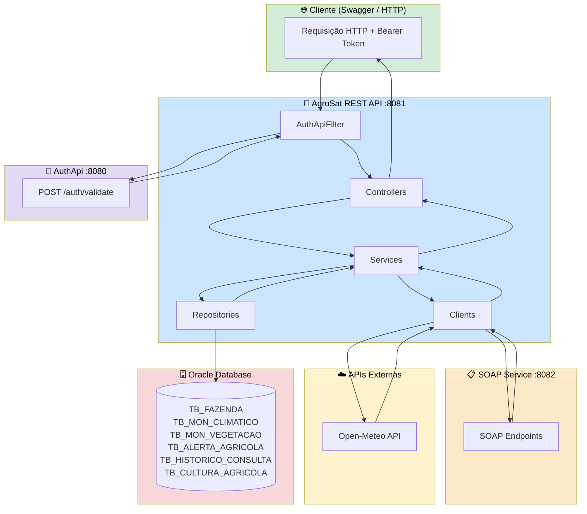
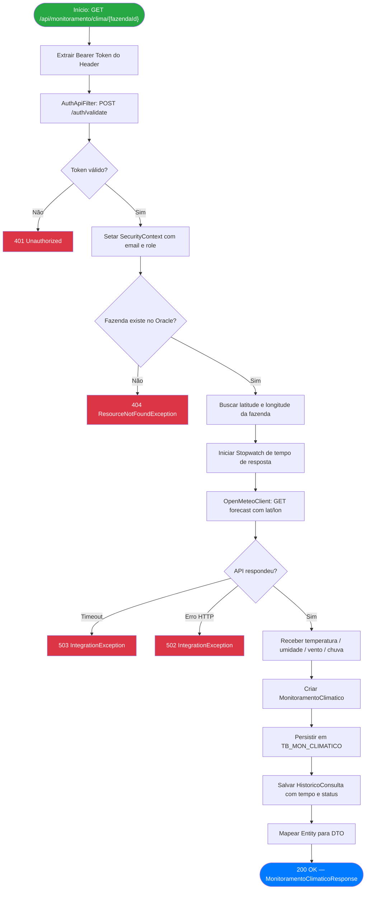
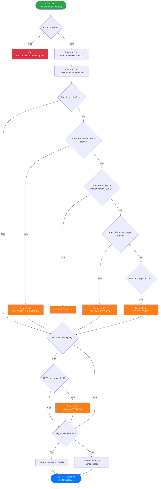
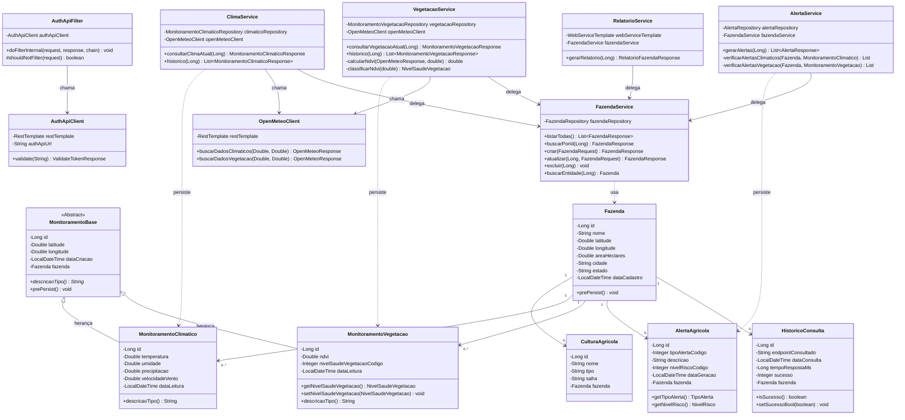
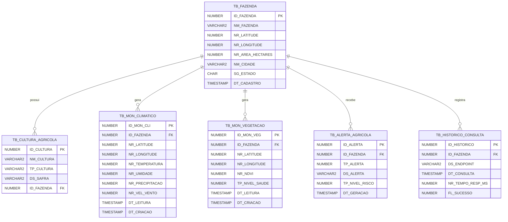

# 🚀 AgroSat REST API

> **Space Connect – Tecnologia Espacial Aplicada a Desafios Reais**  
> Serviço REST de Monitoramento Agrícola com dados climáticos e de satélite

---

## 👥 Integrantes

| RM | Nome |
|---|---|
| 557538 | David Cordeiro |
| 555619 | Tiago Morais |
| 557065 | Vinicius Augusto |
| 556892 | Guilherme Lunghini |
| 99856 | Marchel Augusto |

---

## 📋 Sobre o Projeto

A **AgroSat REST API** é o serviço central da arquitetura SOA do Space Connect. Ela expõe uma API RESTful completa para monitoramento agrícola, integrando dados climáticos em tempo real via **Open-Meteo API**, calculando o **índice NDVI** de vegetação e gerando **alertas automáticos** com base em limiares agronômicos.

Este serviço **não autentica usuários localmente** — toda validação de identidade é delegada à **AuthApi** via chamada HTTP, demonstrando o princípio SOA de reutilização de serviços. Os relatórios consolidados são obtidos via **AgroSat SOAP Service**, demonstrando interoperabilidade REST ↔ SOAP.

---

## 🏗️ Arquitetura e Características

### Papel na Arquitetura SOA

```
Cliente (Swagger / HTTP)
        ↓
AgroSat REST API  ←→  AuthApi (validação JWT)
        ↓
AgroSat SOAP Service (relatórios)
        ↓
Oracle Database (tabelas compartilhadas)
        ↓
Open-Meteo API (dados climáticos externos)
```

### Características Técnicas

| Característica | Detalhe |
|---|---|
| **Framework** | Spring Boot 3.4.5 |
| **Linguagem** | Java 21 |
| **Segurança** | Spring Security + delegação JWT para AuthApi |
| **Banco de dados** | Oracle (mesmo schema do projeto .NET) |
| **ORM** | Spring Data JPA + Hibernate |
| **Documentação** | Springdoc OpenAPI 2.8.8 (Swagger UI) |
| **Client HTTP** | RestTemplate (AuthApi + Open-Meteo) |
| **Client SOAP** | Spring WS WebServiceTemplate |
| **Validação** | Bean Validation (Jakarta Validation) |
| **Porta** | 8081 |

---

## 📁 Estrutura de Pacotes

```
com.agrosatmonitor.api/
├── AgroSatApiApplication.java
├── config/
│   ├── SecurityConfig.java          ← Spring Security (stateless, sem JWT local)
│   ├── SwaggerConfig.java           ← OpenAPI com Bearer auth
│   ├── RestTemplateConfig.java      ← HttpClient com timeout configurado
│   └── WebServiceClientConfig.java  ← SOAP client (Jaxb2Marshaller)
├── security/
│   └── AuthApiFilter.java           ← Filtro que delega validação para AuthApi
├── controller/
│   ├── FazendaController.java
│   ├── CulturaController.java
│   ├── MonitoramentoController.java
│   ├── AlertaController.java
│   └── RelatorioController.java     ← Consome SOAP Service
├── service/
│   ├── FazendaService.java
│   ├── CulturaService.java
│   ├── ClimaService.java            ← Chama Open-Meteo API
│   ├── VegetacaoService.java        ← Calcula NDVI
│   ├── AlertaService.java           ← Gera alertas automáticos
│   ├── HistoricoService.java
│   └── RelatorioService.java        ← Chama SOAP Service
├── client/
│   ├── AuthApiClient.java           ← POST /auth/validate
│   └── OpenMeteoClient.java         ← GET dados climáticos e radiação solar
├── entity/
│   ├── MonitoramentoBase.java       ← Classe ABSTRATA (herança POO)
│   ├── MonitoramentoClimatico.java  ← Herda MonitoramentoBase
│   ├── MonitoramentoVegetacao.java  ← Herda MonitoramentoBase
│   ├── Fazenda.java
│   ├── CulturaAgricola.java
│   ├── AlertaAgricola.java
│   └── HistoricoConsulta.java
├── dto/
│   ├── fazenda/     FazendaRequest, FazendaResponse
│   ├── cultura/     CulturaRequest, CulturaResponse
│   ├── monitoramento/ MonitoramentoClimaticoResponse, MonitoramentoVegetacaoResponse
│   ├── alerta/      AlertaResponse
│   ├── historico/   HistoricoResponse
│   ├── auth/        ValidateTokenRequest, ValidateTokenResponse
│   ├── relatorio/   RelatorioFazendaResponse
│   ├── external/    OpenMeteoResponse
│   └── soap/        ConsultarRelatorioRequest/Response, ProcessarRiscoRequest/Response
├── enums/
│   ├── TipoAlerta.java          (1=Seca, 2=TemperaturaExtrema, 3=BaixaVegetacao...)
│   ├── NivelRisco.java          (1=Baixo, 2=Medio, 3=Alto, 4=Critico)
│   └── NivelSaudeVegetacao.java (1=Critica ... 5=Excelente)
├── repository/
│   ├── FazendaRepository.java
│   ├── CulturaRepository.java
│   ├── MonitoramentoClimaticoRepository.java
│   ├── MonitoramentoVegetacaoRepository.java
│   ├── AlertaRepository.java
│   └── HistoricoRepository.java
└── exception/
    ├── GlobalExceptionHandler.java      ← @RestControllerAdvice
    ├── ResourceNotFoundException.java
    ├── IntegrationException.java
    ├── UnauthorizedException.java
    ├── BusinessException.java
    └── ErrorResponse.java               ← Padrão de resposta de erro
```

---

## 🔐 Segurança e Autenticação

Este serviço **não valida JWT localmente**. O fluxo completo é:

```
1. Cliente envia: Authorization: Bearer <token>
2. AuthApiFilter intercepta a requisição
3. REST API faz POST http://localhost:8080/auth/validate {token}
4. AuthApi retorna: {valid: true, email: "...", role: "USER"}
5. SecurityContext é preenchido com email + ROLE_USER
6. Request prossegue normalmente
```

Roles suportadas:

| Role | Acesso |
|---|---|
| `USER` | Fazendas, Culturas, Monitoramento, Alertas |
| `ADMIN` | Tudo acima + `GET /api/relatorios/fazenda/{id}` |

---

## 📡 Endpoints

### Fazendas
| Método | Rota | Descrição |
|---|---|---|
| `GET` | `/api/fazendas` | Lista todas as fazendas |
| `GET` | `/api/fazendas/{id}` | Busca fazenda por ID |
| `POST` | `/api/fazendas` | Cadastra nova fazenda |
| `PUT` | `/api/fazendas/{id}` | Atualiza fazenda |
| `DELETE` | `/api/fazendas/{id}` | Remove fazenda |

### Culturas
| Método | Rota | Descrição |
|---|---|---|
| `GET` | `/api/culturas` | Lista todas as culturas |
| `GET` | `/api/culturas/{id}` | Busca por ID |
| `GET` | `/api/culturas/fazenda/{id}` | Culturas de uma fazenda |
| `POST` | `/api/culturas` | Cadastra cultura |
| `PUT` | `/api/culturas/{id}` | Atualiza cultura |
| `DELETE` | `/api/culturas/{id}` | Remove cultura |

### Monitoramento
| Método | Rota | Descrição |
|---|---|---|
| `GET` | `/api/monitoramento/clima/{fazendaId}` | Clima atual via Open-Meteo |
| `GET` | `/api/monitoramento/clima/{fazendaId}/historico` | Últimos 30 registros climáticos |
| `GET` | `/api/monitoramento/vegetacao/{fazendaId}` | NDVI calculado via Open-Meteo |
| `GET` | `/api/monitoramento/vegetacao/{fazendaId}/historico` | Últimos 30 registros de NDVI |
| `GET` | `/api/monitoramento/historico/{fazendaId}` | Log das últimas 50 consultas externas |

### Alertas
| Método | Rota | Descrição |
|---|---|---|
| `GET` | `/api/alertas/{fazendaId}` | Gera e retorna alertas automáticos |

### Relatórios *(requer role ADMIN)*
| Método | Rota | Descrição |
|---|---|---|
| `GET` | `/api/relatorios/fazenda/{id}` | Relatório consolidado via SOAP Service |

---
# 📊 Diagramas — AgroSat REST API

---

## 🏗️ Diagrama de Arquitetura



---

## 🔄 Fluxograma — Autenticação e Monitoramento Climático



---

## 🔄 Fluxograma — Geração de Alertas



---

## 🧩 Diagrama de Classes



---

## 🗃️ Diagrama de Entidades (Oracle)



--- 

## 🌿 Cálculo de NDVI

O **NDVI (Normalized Difference Vegetation Index)** é estimado a partir de variáveis climáticas obtidas da Open-Meteo:

| NDVI | Nível de Saúde | Interpretação |
|---|---|---|
| `< 0.10` | Crítica | Solo exposto ou vegetação em colapso |
| `0.10 – 0.25` | Baixa | Vegetação com baixo vigor — intervenção necessária |
| `0.25 – 0.45` | Moderada | Vegetação com vigor moderado — monitorar |
| `0.45 – 0.65` | Boa | Vegetação saudável |
| `> 0.65` | Excelente | Vegetação com alto vigor |

---

## 🚨 Alertas Automáticos

O endpoint `GET /api/alertas/{fazendaId}` analisa os últimos registros e gera alertas:

| Tipo | Condição |
|---|---|
| `TEMPERATURA_EXTREMA` | Temperatura > 38°C ou < 5°C |
| `SECA` | Precipitação = 0 e umidade < 30% |
| `CHUVA_EXCESSIVA` | Precipitação > 50mm |
| `VENTO_FORTE` | Velocidade do vento > 60 km/h |
| `BAIXA_VEGETACAO` | NDVI < 0.25 |

---

## ⚙️ Configuração

### application.properties

```properties
server.port=8081

# Oracle (mesmo banco do .NET)
spring.datasource.url=jdbc:oracle:thin:@oracle.fiap.com.br:1521:orcl
spring.datasource.username=SEU_RM
spring.datasource.password=SUA_SENHA

# HikariCP — evita ORA-17008
spring.datasource.hikari.max-lifetime=1800000
spring.datasource.hikari.keepalive-time=60000
spring.datasource.hikari.connection-test-query=SELECT 1 FROM DUAL

# AuthApi
auth.api.url=http://localhost:8080
auth.api.validate-endpoint=/auth/validate

# SOAP Service
soap.service.url=http://localhost:8082/ws
soap.service.namespace=http://agrosatmonitor.com/soap
```

---

## ▶️ Como Executar

**Pré-requisitos:** Java 21, Maven 3.9+, Oracle FIAP acessível, AuthApi rodando na porta 8080.

```bash
# Opcional: SOAP Service deve estar rodando na porta 8082
cd agrosat-rest-api
mvn clean package -DskipTests
mvn spring-boot:run
```

**Swagger UI:** `http://localhost:8081/swagger-ui.html`

### Fluxo de teste no Swagger

```
1. Autentique no AuthApi (POST :8080/auth/login) → copie o token
2. Clique em "Authorize" no Swagger → cole o token
3. POST /api/fazendas → crie uma fazenda com lat/lon válidos
4. GET  /api/monitoramento/clima/{id} → dados climáticos reais
5. GET  /api/monitoramento/vegetacao/{id} → NDVI calculado
6. GET  /api/alertas/{id} → alertas gerados automaticamente
7. GET  /api/relatorios/fazenda/{id} → relatório via SOAP (role ADMIN)
```

---

## 🧩 Conceitos de POO Demonstrados

### Herança e Abstração

```java
// Classe ABSTRATA — nunca instanciada diretamente
@MappedSuperclass
public abstract class MonitoramentoBase {
    private Long id;
    private Double latitude, longitude;
    private LocalDateTime dataCriacao;

    public abstract String descricaoTipo(); // POLIMORFISMO
}

// Especialização climática
public class MonitoramentoClimatico extends MonitoramentoBase {
    @Override
    public String descricaoTipo() {
        return String.format("Climático: %.1f°C", temperatura);
    }
}

// Especialização de vegetação
public class MonitoramentoVegetacao extends MonitoramentoBase {
    @Override
    public String descricaoTipo() {
        return String.format("Vegetação: NDVI=%.4f", ndvi);
    }
}
```

### Encapsulamento

DTOs implementados como Java **Records** imutáveis — isolam completamente a camada de apresentação das entidades JPA:

```java
public record FazendaResponse(Long id, String nome, Double latitude,
                               Double longitude, Double areaHectares,
                               String cidade, String estado,
                               LocalDateTime dataCadastro) {}
```

---

